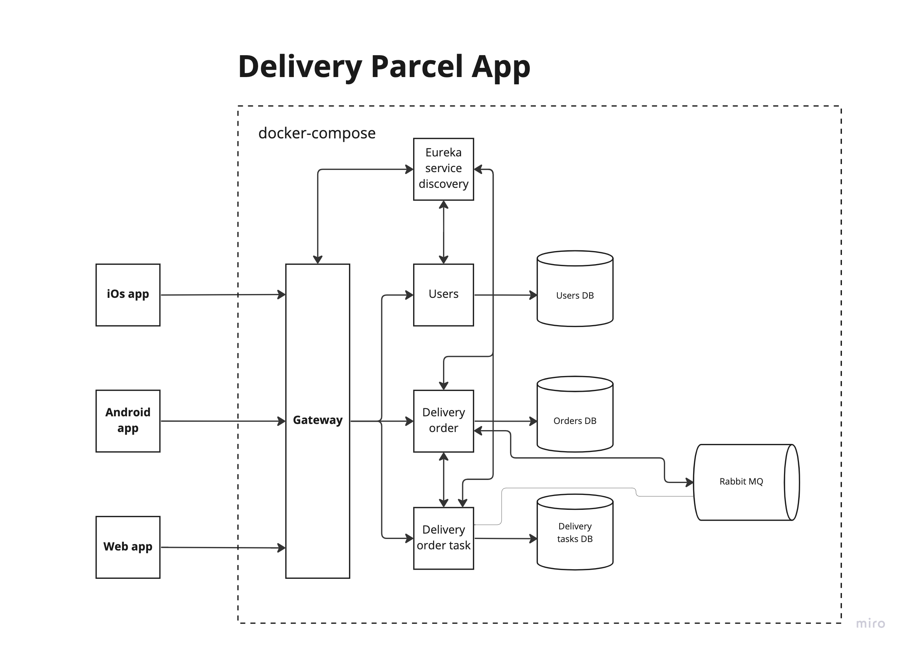
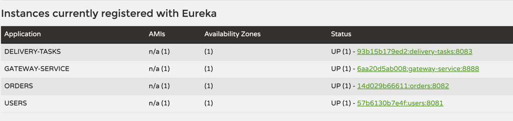
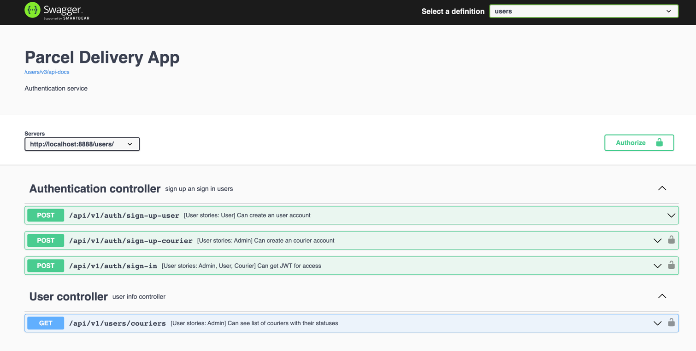
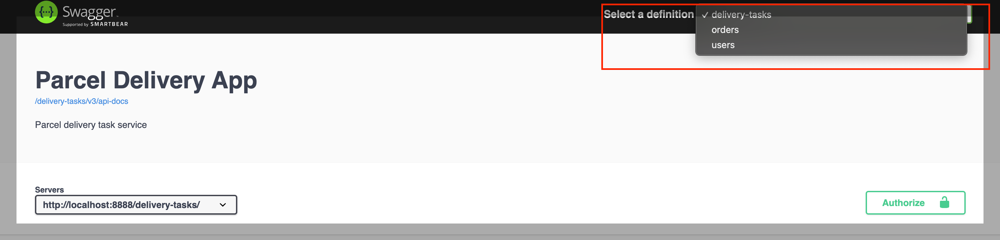

P@ssw0rd

http://localhost:8888/webjars/swagger-ui/index.html?urls.primaryName=users



# PARCEL DELIVERY APPLICATION

This is a basic application for parcel delivery designed to showcase the Microservice Architecture Model by utilizing
technologies such as Spring Boot, Spring Cloud, Rabbitmq, and Docker.

## Tech stack

- java 17
- Gradle
- Spring Boot 3
- Spring Security with JWT Token
- Spring Cloud Gateway
- Rabbitmq
- Docker
- Swagger

## Infrastructure


### Users Service

The system stores the user domain model and delegates authorization responsibilities to an Authorization Server that
issues JWT tokens for backend resource services. The Authorization Server is responsible for both user authentication
and secure service-to-service communication within the system perimeter.

### Gateway Service

The system utilizes **Spring Cloud Gateway** as a sole entry point to handle incoming requests and direct them to the
corresponding backend service.

### Eureka server

Eureka Server is a service registry and discovery server for microservices. It allows services to register themselves and enables the communication between them. Eureka provides features such as automatic registration and deregistration of services, load balancing, and failover mechanisms, and works well with other Spring Cloud components.

### Order Service

This service is for the creation of parcel delivery orders, which contain order details. Any modifications made to the order, such as updates or cancellations, are then transmitted via a RabbitMQ queue.

### Delivery Task Service

The Delivery Task service is in charge of generating delivery tasks for couriers and storing their current location data. Couriers can update task status and send a message to RabbitMQ via the service, which then triggers a change in the delivery order's status once it is processed.

## Information about the application

### Users

The application contains a table that lists all users marked as "ready", and users can add new ones. Additionally, admin users have the ability to define new courier users.

|     username      | password |     role     |
|:-----------------:|:--------:|:------------:| 
|  user@gmail.com   | P@ssw0rd |  ROLE_USER   | 
|  admin@gmail.com  | P@ssw0rd |  ROLE_ADMIN  |  
| courier@gmail.com | P@ssw0rd | ROLE_COURIER |  

### Important endpoint

<a href="http://localhost:8888/webjars/swagger-ui/index.html?urls.primaryName=users">Parcel delivery application Swagger</a>


### Database information

|  Database  | Host(in docker) | Host(in machine) | Port |
|:----------:|:---------------:|:----------------:|:----:|
|  delivery_tasks   |    POSTGRES     |    localhost     | 5432 |  
| orders |    POSTGRES     |    localhost     | 5432 | 
|   users   |    POSTGRES     |    localhost     | 5432 | 

### Rabbitmq information

 Host(in docker) | Host(in machine) | Port  |
|:---------------:|:----------------:|:-----:|  
|    rabbitmq3    |    localhost     | 15672 | 

## Let's try it out

The application can be run in 2 ways.

1) The application is copied to the local machine. Postgres and rabbitmq are installed and run with the configurations
   defined above. Spring boot services are run.
2) Run compose.yml with Docker (It may take up to 1 minute for the services to be ready).
   ``` docker compose up```

   ```bash
   ./gradlew clean build
   ```

   ``` bash
   docker compose up -d
   ```

   This link can be used to verify which services are currently active.
   <a href="http://localhost:8761/">Eureka server</a>

   Swagger will be run on this link
   <a href="http://localhost:8888/webjars/swagger-ui/index.html?urls.primaryName=users">Parcel delivery application Swagger</a>

   Switch between services


